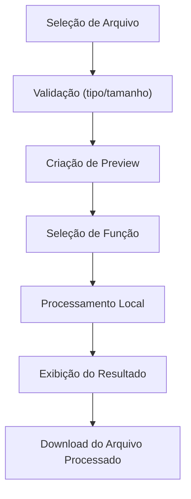
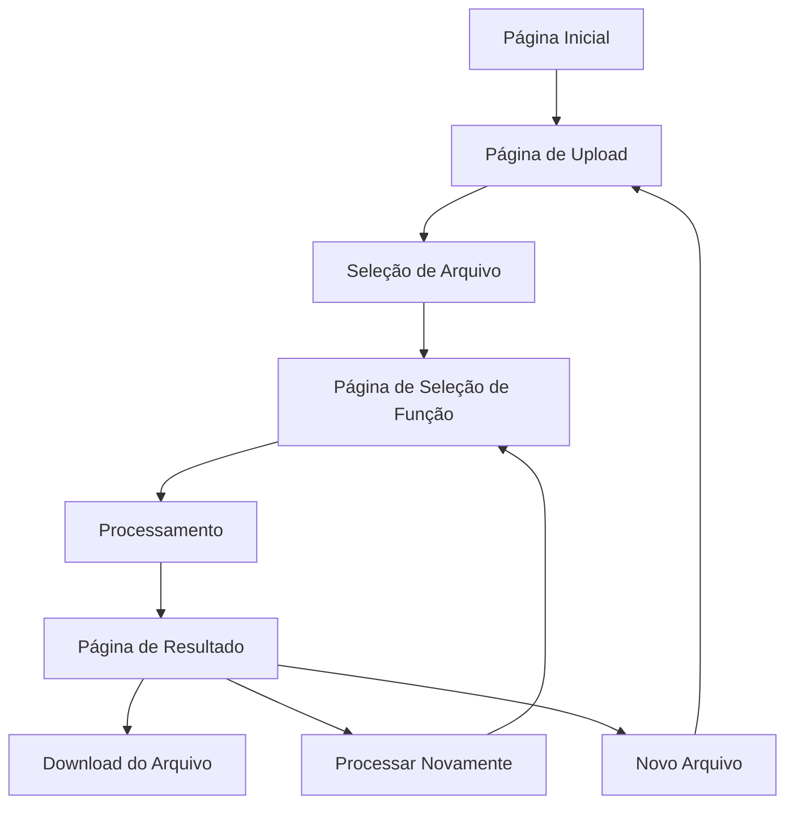

# Documentação Técnica: Zelya IA

## 1. Introdução

### 1.1 Descrição Geral do Projeto

Zelya IA é uma aplicação web moderna desenvolvida com Next.js que permite aos usuários aplicar transformações e efeitos em arquivos de mídia (imagens, vídeos e áudios) diretamente no navegador. O aplicativo utiliza processamento client-side para garantir privacidade e velocidade, sem necessidade de upload para servidores externos.

### 1.2 Propósito do Aplicativo

Zelya IA foi concebida como uma ferramenta utilitária pessoal que democratiza o acesso a recursos de edição de mídia, tradicionalmente disponíveis apenas em softwares complexos e pagos. O aplicativo visa simplificar o processo de edição para usuários comuns, sem necessidade de conhecimentos técnicos avançados.

### 1.3 Público-alvo

- Usuários casuais que precisam de edições rápidas e simples
- Criadores de conteúdo que necessitam de ferramentas básicas de edição
- Estudantes e educadores que trabalham com mídia digital
- Profissionais que precisam de ajustes rápidos em arquivos de mídia


## 2. Funcionalidades do Sistema

### 2.1 Processamento de Imagem

| Funcionalidade | Descrição | Implementação
|-----|-----|-----
| Inverter cores | Inverte todas as cores da imagem | Manipulação de pixels via Canvas API
| Preto e branco | Converte a imagem para escala de cinza | Aplicação de filtro CSS grayscale
| Efeito vintage | Aplica um filtro retrô à imagem | Combinação de filtros sepia, contrast e brightness


### 2.2 Processamento de Áudio

| Funcionalidade | Descrição | Implementação
|-----|-----|-----
| Acelerar áudio | Aumenta a velocidade de reprodução | Manipulação de AudioBuffer com taxa de 1.5x
| Áudio lento | Reduz a velocidade de reprodução | Manipulação de AudioBuffer com taxa de 0.7x
| Distorcer voz | Aplica efeitos de distorção | Transformação não-linear de amostras de áudio


### 2.3 Processamento de Vídeo

| Funcionalidade | Descrição | Implementação
|-----|-----|-----
| Acelerar vídeo | Aumenta a velocidade de reprodução | Simulação via filtros CSS (implementação completa pendente)
| Câmera lenta | Reduz a velocidade de reprodução | Simulação via filtros CSS (implementação completa pendente)
| Preto e branco | Remove as cores do vídeo | Aplicação de filtro CSS grayscale


### 2.4 Pré-visualização de Arquivos

O sistema oferece pré-visualização em tempo real para todos os tipos de mídia suportados:

- **Imagens**: Exibição direta com tags 
- **Vídeos**: Player integrado com controles via tag <video>
- **Áudios**: Player de áudio com controles via tag <audio> e visualização com ícone


## 3. Arquitetura do Projeto

### 3.1 Tecnologias Utilizadas

- **Frontend**:

- Next.js 14 (App Router)
- React 18
- TypeScript
- Tailwind CSS
- Lucide React (ícones)
- shadcn/ui (componentes de UI)


- **Processamento de Mídia**:

- Web Audio API (processamento de áudio)
- Canvas API (processamento de imagem)
- CSS Filters (efeitos visuais)


---

## 3.2 Organização de Diretórios e Arquivos

```plaintext
zelya-ia/
├── app/                      # Diretório principal do Next.js App Router
│   ├── contato/              # Página de contato
│   │   └── page.tsx
│   ├── resultado/            # Página de resultados
│   │   └── page.tsx
│   ├── selecionar-funcao/    # Página de seleção de funções
│   │   └── page.tsx
│   ├── sobre/                # Página sobre
│   │   └── page.tsx
│   ├── upload/               # Página de upload
│   │   └── page.tsx
│   ├── globals.css           # Estilos globais
│   ├── layout.tsx            # Layout principal da aplicação
│   └── page.tsx              # Página inicial
├── components/               # Componentes reutilizáveis
│   ├── footer.tsx            # Componente de rodapé
│   ├── header.tsx            # Componente de cabeçalho
│   └── ui/                   # Componentes de UI (shadcn)
├── lib/                      # Utilitários e lógica de negócio
│   ├── constants/            # Constantes da aplicação
│   │   └── edit-functions.ts # Definições das funções de edição
│   ├── context/              # Contextos React
│   │   └── app-context.tsx   # Contexto global da aplicação
│   └── utils/                # Funções utilitárias
│       └── file-processing.ts # Funções de processamento de arquivos
├── public/                   # Arquivos estáticos
├── tailwind.config.ts        # Configuração do Tailwind CSS
└── package.json              # Dependências e scripts
```

---

### 3.3 Comunicação entre Frontend e Backend

O aplicativo Zelya IA opera principalmente no cliente (navegador), sem necessidade de um backend tradicional para o processamento de mídia. Todo o processamento é realizado localmente usando APIs do navegador:

1. **Upload de Arquivos**: Gerenciado pelo navegador via input de arquivo
2. **Processamento**: Executado localmente usando Web APIs (Canvas, Audio API)
3. **Armazenamento**: Temporário usando URLs de objeto (URL.createObjectURL)


### 3.4 Pipeline de Upload e Processamento


## 4. Instalação e Execução Local

### 4.1 Pré-requisitos

- Node.js 18.0.0 ou superior
- npm 9.0.0 ou superior (ou yarn/pnpm)
- Navegador moderno com suporte a Web Audio API e Canvas API


### 4.3 Comandos Disponíveis

| Comando | Descrição
|-----|-----
| npm run dev | Inicia o servidor de desenvolvimento
| npm run build | Cria uma versão otimizada para produção
| npm start | Inicia o servidor de produção após o build
| npm run lint | Executa a verificação de linting


## 5. Frontend
---

## 5.1 Estrutura das Páginas

| Página            | Rota                 | Descrição                                                   |
| ----------------- | -------------------- | ----------------------------------------------------------- |
| Home              | `/`                  | Página inicial com apresentação e acesso às funcionalidades |
| Upload            | `/upload`            | Seleção e upload de arquivos (imagem, vídeo, áudio)         |
| Seleção de Função | `/selecionar-funcao` | Escolha da função de edição a ser aplicada                  |
| Resultado         | `/resultado`         | Visualização do resultado e opções de download              |
| Sobre             | `/sobre`             | Informações sobre o projeto e tecnologias                   |
| Contato           | `/contato`           | Formulário de contato e informações                         |

---

## 5.2 Componentes Principais

| Componente     | Descrição                        | Localização                    |
| -------------- | -------------------------------- | ------------------------------ |
| `Header`       | Cabeçalho com navegação          | `/components/header.tsx`       |
| `Footer`       | Rodapé com informações           | `/components/footer.tsx`       |
| `AppProvider`  | Contexto global da aplicação     | `/lib/context/app-context.tsx` |
| `FileTypeIcon` | Ícone baseado no tipo de arquivo | Componente interno             |

---

## 5.3 Gerenciamento de Estado

O aplicativo utiliza a Context API do React para gerenciar o estado global:

```ts
interface AppContextType {
  selectedFile: File | null;
  setSelectedFile: (file: File | null) => void;

  fileType: FileType | null;
  setFileType: (type: FileType | null) => void;

  selectedFunction: EditFunction | null;
  setSelectedFunction: (func: EditFunction | null) => void;

  filePreview: string | null;
  setFilePreview: (url: string | null) => void;

  processedFilePreview: string | null;
  setProcessedFilePreview: (url: string | null) => void;

  isProcessing: boolean;
  setIsProcessing: (processing: boolean) => void;

  resetAll: () => void;
}
```

---

## 6. Casos de Uso e Fluxos de Usuário

### 6.1 Fluxo Principal

### 6.2 Cenários de Uso

#### Cenário 1: Converter uma foto para preto e branco

1. Usuário acessa a página inicial
2. Clica em "Bora Começar!✨"
3. Seleciona "Imagem" e faz upload de uma foto
4. Na página de seleção, escolhe "Preto e branco"
5. Visualiza o resultado e faz o download da imagem processada


#### Cenário 2: Acelerar um áudio

1. Usuário acessa a página inicial
2. Clica em "Bora Começar!✨"
3. Seleciona "Áudio" e faz upload de um arquivo MP3
4. Na página de seleção, escolhe "Acelerar áudio"
5. Ouve o resultado e faz o download do áudio processado

#### Cenário 3: Vídeo em câmera lenta

1. Usuário acessa a página inicial
2. Clica em "Bora Começar!✨"
3. Seleciona "Vídeo" e faz upload de um arquivo MP4
4. Na página de seleção, escolhe "Câmera lenta"
5. Visualiza o resultado e faz o download do vídeo processado


## 7. Testes

### 7.1 Estratégia de Testes

O projeto utiliza principalmente testes manuais para validação das funcionalidades, com foco em:

- Compatibilidade entre navegadores
- Validação de formatos de arquivo
- Verificação visual dos resultados de processamento
- Testes de usabilidade da interface


### 7.2 Como Testar Cada Funcionalidade

#### Teste de Processamento de Imagem

1. Prepare imagens de teste em formatos JPG e PNG
2. Acesse a página de upload e selecione cada imagem
3. Aplique cada um dos filtros disponíveis
4. Verifique se o resultado visual corresponde ao esperado
5. Teste o download do arquivo processado


#### Teste de Processamento de Áudio

1. Prepare arquivos de áudio em formatos MP3 e WAV
2. Acesse a página de upload e selecione cada arquivo
3. Aplique cada uma das transformações disponíveis
4. Verifique se o resultado sonoro corresponde ao esperado
5. Teste o download do arquivo processado

#### Teste de Processamento de Vídeo

1. Prepare arquivos de vídep em formatos MP4 e WEBM
2. Acesse a página de upload e selecione cada arquivo
3. Aplique cada uma das transformações disponíveis
4. Verifique se o resultado visual corresponde ao esperado
5. Teste o download do arquivo processado


## 8. Problemas Conhecidos e Limitações

### 8.1 Limitações Técnicas

- **Processamento de Vídeo**: Implementação atual é limitada a filtros CSS simples, sem manipulação real do conteúdo
- **Tamanho dos Arquivos**: Limitado pela memória disponível no navegador do usuário
- **Formatos Suportados**: Apenas formatos mais comuns são suportados (JPG/PNG para imagens, MP3/WAV para áudio, MP4/WEBM para vídeo)
- **Processamento Local**: Todo processamento ocorre no cliente, limitando a complexidade das operações


### 8.2 Problemas Conhecidos

- O processamento de vídeos grandes pode causar travamentos em dispositivos com recursos limitados
- A qualidade do áudio processado pode ser reduzida devido às limitações da Web Audio API
- Alguns navegadores móveis podem ter comportamento inconsistente com a API de arquivos


## 9. Contribuição e Desenvolvimento Futuro

### 9.1 Como Contribuir

1. Faça um fork do repositório
2. Crie uma branch para sua feature (git checkout -b feature/nova-funcionalidade)
3. Implemente suas mudanças
4. Execute os testes manuais para garantir que tudo funciona
5. Faça commit das alterações (git commit -m 'Adiciona nova funcionalidade')
6. Envie para o GitHub (git push origin feature/nova-funcionalidade)
7. Abra um Pull Request


### 9.2 Funcionalidades Planejadas

- **Processamento de Imagem**:

- Recorte inteligente
- Remoção de fundo com IA
- Ajustes de cor avançados


- **Processamento de Áudio**:

- Remoção de ruído
- Equalização automática
- Conversão de voz para texto


- **Processamento de Vídeo**:

- Corte e edição básica
- Adição de legendas
- Estabilização de vídeo


### 9.3 Melhorias Técnicas Desejadas

- Implementação de Web Workers para processamento em segundo plano
- Adição de testes automatizados
- Suporte a mais formatos de arquivo
- Implementação de processamento em lote
- Integração com serviços de armazenamento em nuvem


## 10. Licença e Autoria

### 10.1 Licença

Este projeto está licenciado sob a licença MIT - veja o arquivo LICENSE para detalhes.

### 10.2 Autoria

Desenvolvido por Equipe Zelya IA — Sofia S. e Francielly A. 💜
